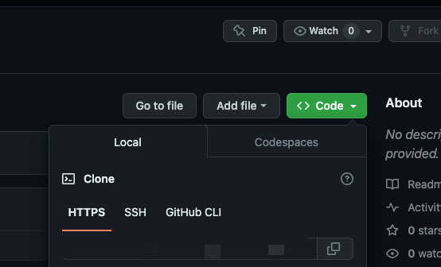
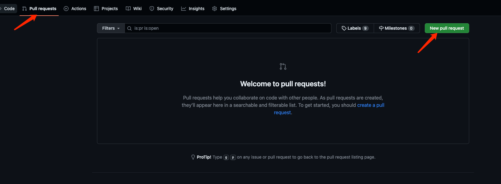

## 此说明是用来总结拉去Github上开源项目时提PR的流程

一、首先fork项目到自己的仓库中
原本的代码是别人的，并且没有权限去修改，所以需要先fork到自己的仓库中，然后再进行修改。

此时fork的项目有了修改的权限，然后下一步就是将fork的项目clone到本地进行修改。

二、clone项目到本地
在自己的仓库下面复制刚刚fork的项目副本链接地址。

然后在本地使用git clone命令将项目clone到本地。
git clone xxxx.git

三、修改项目
在本地修改项目，然后提交到自己的仓库中。
commit->push

四、提交PR
在自己的仓库中点击New pull request按钮，然后选择要提交的分支，点击Create pull request按钮，然后填写PR的标题和内容，点击Create pull request按钮，PR就提交成功了。
